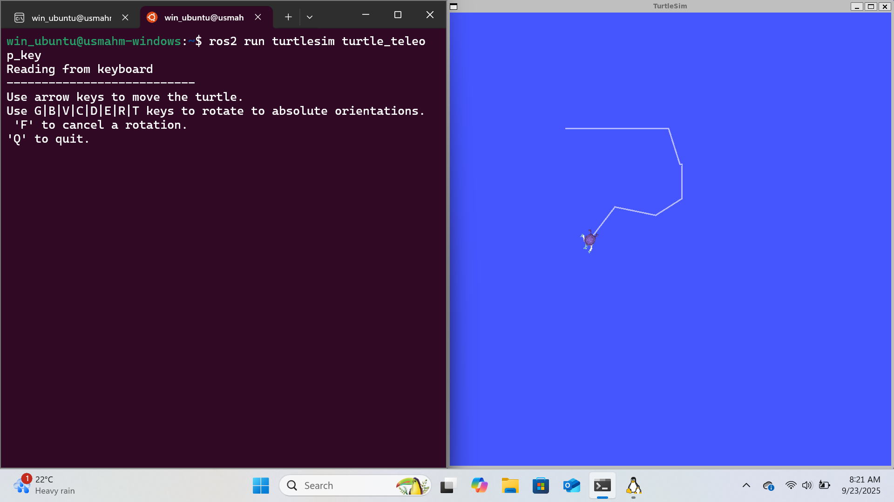
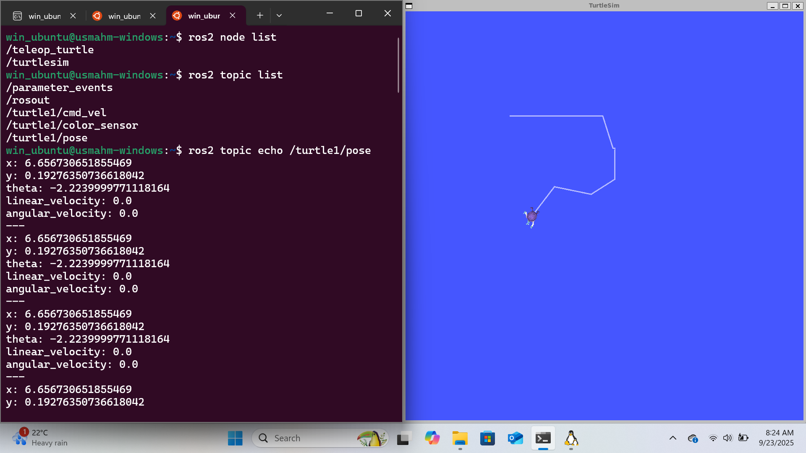
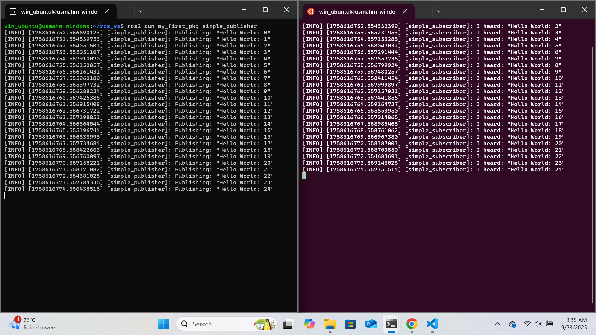
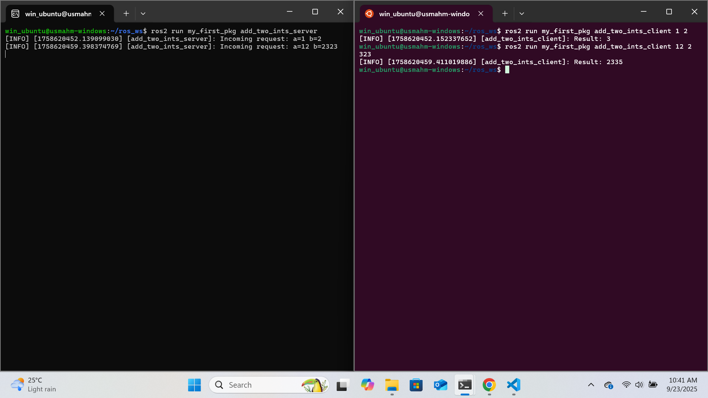

# 🐢 ROS2 Workshop: Hands-On Introduction

Welcome to today’s ROS2 workshop! 🎉  
This class is designed to be **fun, practical, and interactive**, you’ll see things move, create your own packages, and write nodes that communicate with each other 🚀.

---

## 📌 Prerequisites

- ROS2 (Humble) installed on your system
- Basic Linux terminal knowledge (the commands should be run in your terminal)
- A sense of curiosity 😎

---

## 1. Getting Started with Turtlesim

Turtlesim is a simple ROS2 package that lets us control a turtle in a 2D environment.  
It’s great for understanding **nodes, topics, and services** without any complex setup.

### 🔹 Launch Turtlesim

```bash
ros2 run turtlesim turtlesim_node
```

You should see a window with a cute turtle 🐢.

---

### 🔹 Control the Turtle

Open a new terminal and run the teleop node:

```bash
ros2 run turtlesim turtle_teleop_key
```

Now use your keyboard arrows to move the turtle around 🎮.



### 🔹 Inspect the Nodes

Here we get a sense of how the nodes are interacting with each other
See what nodes are running:

```bash
ros2 node list
```

Check available topics:

```bash
ros2 topic list
```

Look inside a topic:

```bash
ros2 topic echo /turtle1/pose
```



### 🔹 Call a Service

Change turtle background color:

```bash
ros2 service call /clear std_srvs/srv/Empty
```

Teleport the turtle:

```bash
ros2 service call /turtle1/teleport_absolute turtlesim/srv/TeleportAbsolute "{x: 5.0, y: 5.0, theta: 0.0}"
```

---

## 2. Creating Your Own Workspace

Now let’s create our own ROS2 workspace where we’ll build our own nodes.

```bash
mkdir -p ~/ros2_ws/src
cd ~/ros2_ws

# build and source our ros2 workspace
colcon build
source install/setup.bash
```

---

## 3. Writing Your First Node (Publisher & Subscriber)

Navigate to `src` and create a new package:

```bash
cd ~/ros2_ws/src
ros2 pkg create --build-type ament_python my_first_pkg

# Open your vscode using the command
code .
```

---

<!-- Edit these to include counter -->

### 🔹 Example Publisher (`simple_publisher.py`)

Create file: `my_first_pkg/my_first_pkg/simple_publisher.py`


```python
import rclpy
from rclpy.node import Node
from std_msgs.msg import String

class SimplePublisher(Node):
    def __init__(self):
        super().__init__('simple_publisher')
        self.publisher_ = self.create_publisher(String, 'chatter', 10)
        timer_period = 1.0
        self.timer = self.create_timer(timer_period, self.timer_callback)

    def timer_callback(self):
        msg = String()
        msg.data = 'Hello ROS2!'
        self.publisher_.publish(msg)
        self.get_logger().info(f'Publishing: "{msg.data}"')

def main(args=None):
    rclpy.init(args=args)
    node = SimplePublisher()
    rclpy.spin(node)
    node.destroy_node()
    rclpy.shutdown()

if __name__ == '__main__':
    main()
```

---

### 🔹 Example Subscriber (`simple_subscriber.py`)

Create file: `my_first_pkg/my_first_pkg/simple_subscriber.py`

```python
import rclpy
from rclpy.node import Node
from std_msgs.msg import String

class SimpleSubscriber(Node):
    def __init__(self):
        super().__init__('simple_subscriber')
        self.subscription = self.create_subscription(
            String,
            'chatter',
            self.listener_callback,
            10)

    def listener_callback(self, msg):
        self.get_logger().info(f'I heard: "{msg.data}"')

def main(args=None):
    rclpy.init(args=args)
    node = SimpleSubscriber()
    rclpy.spin(node)
    node.destroy_node()
    rclpy.shutdown()

if __name__ == '__main__':
    main()
```

### 🔹 Update `package.xml`

Inside `my_first_pkg/my_first_pkg/package.xml`, add dependencies:

```xml
<exec_depend>rclpy</exec_depend>
<exec_depend>std_msgs</exec_depend>
```

### 🔹 Update `setup.py`

Inside `my_first_pkg/my_first_pkg/setup.py`, update `entry_points`:

```python
entry_points={
    'console_scripts': [
        'simple_publisher = my_first_pkg.simple_publisher:main',
        'simple_subscriber = my_first_pkg.simple_subscriber:main',
    ],
},
```

---

<!-- setup environment before running nodes -->

### 🔹 Run the Nodes (On the Ubuntu terminal)

Rebuild and source:

```bash
cd ~/ros2_ws
colcon build
source install/setup.bash
```

Run publisher:

```bash
ros2 run my_first_pkg simple_publisher
```

Run subscriber:

```bash
ros2 run my_first_pkg simple_subscriber
```

Watch them communicate! 🎉


💡 **Try it Yourself**:

- Change the message from `"Hello ROS2!"` to something else.
- Change the topic name from `"chatter"` to `"greetings"`. What happens?

---

## 4. Creating and Using a Service

### 🔹 Define a Service

First, create a new package for interfaces:

```bash
cd ~/ros2_ws/src
ros2 pkg create --build-type ament_cmake workshop_interfaces
```

Inside `workshop_interfaces/srv/AddTwoInts.srv`:

```srv
int64 a
int64 b
---
int64 sum
```

Update `CMakeLists.txt`:

```cmake
find_package(rosidl_default_generators REQUIRED)

rosidl_generate_interfaces(${PROJECT_NAME}
  "srv/AddTwoInts.srv"
)
```

Update `package.xml`:

```xml
<buildtool_depend>rosidl_default_generators</buildtool_depend>
<exec_depend>rosidl_default_runtime</exec_depend>
<member_of_group>rosidl_interface_packages</member_of_group>
```

Rebuild:

```bash
cd ~/ros2_ws
colcon build
source install/setup.bash
```

---

### 🔹 Service Server Node (`add_two_ints_server.py`)

Create file: `my_first_pkg/my_first_pkg/add_two_ints_server.py`

```python
import rclpy
from rclpy.node import Node
from workshop_interfaces.srv import AddTwoInts

class AddTwoIntsServer(Node):
    def __init__(self):
        super().__init__('add_two_ints_server')
        self.srv = self.create_service(AddTwoInts, 'add_two_ints', self.add_two_ints_callback)

    def add_two_ints_callback(self, request, response):
        response.sum = request.a + request.b
        self.get_logger().info(f'Incoming request: a={request.a} b={request.b}')
        return response

def main(args=None):
    rclpy.init(args=args)
    node = AddTwoIntsServer()
    rclpy.spin(node)
    node.destroy_node()
    rclpy.shutdown()

if __name__ == '__main__':
    main()
```

---

### 🔹 Service Client Node (`add_two_ints_client.py`)

Create file: `my_first_pkg/my_first_pkg/add_two_ints_client.py`

```python
import sys
import rclpy
from rclpy.node import Node
from workshop_interfaces.srv import AddTwoInts

class AddTwoIntsClient(Node):
    def __init__(self):
        super().__init__('add_two_ints_client')
        self.cli = self.create_client(AddTwoInts, 'add_two_ints')
        while not self.cli.wait_for_service(timeout_sec=1.0):
            self.get_logger().info('AddTwoInts Service not available, waiting...')
        self.req = AddTwoInts.Request()

    def send_request(self, a, b):
        self.req.a = a
        self.req.b = b
        return self.cli.call_async(self.req)

def main(args=None):
    rclpy.init(args=args)
    node = AddTwoIntsClient()
    future = node.send_request(int(sys.argv[1]), int(sys.argv[2]))
    rclpy.spin_until_future_complete(node, future)
    response = future.result()
    node.get_logger().info(f'Result: {response.sum}')
    node.destroy_node()
    rclpy.shutdown()

if __name__ == '__main__':
    main()
```

---

### 🔹 Update `package.xml`

Inside `my_first_pkg/my_first_pkg/package.xml`, add dependencies:

```xml
<exec_depend>workshop_interfaces</exec_depend>
```

### 🔹 Update `setup.py`

Inside `my_first_pkg/my_first_pkg/setup.py`, update `entry_points`:

```python
entry_points={
    'console_scripts': [
        'add_two_ints_server = my_first_pkg.add_two_ints_server:main',
        'add_two_ints_client = my_first_pkg.add_two_ints_client:main',
    ],
},
```

---

### 🔹 Run Service

Rebuild and source:

```bash
cd ~/ros2_ws
colcon build
source install/setup.bash
```

Run service server:

```bash
ros2 run my_first_pkg add_two_ints_server
```

In another terminal, run service client:

```bash
ros2 run my_first_pkg add_two_ints_client 2 3
```

Output:

```
Result: 5
```



💡 **Try it Yourself**:

- Modify the service to multiply instead of add.
- Try sending negative numbers.

## 🎯 Wrap-Up

Today you learned:

- How to run and explore **Turtlesim**
- How to create a **workspace & package**
- How to write **publisher & subscriber nodes**
- How to create and call **services & clients**

🚀 Congrats — you just built your first ROS2 system!

This workshop was adapted from [ROS documentation](https://docs.ros.org/en/humble/Tutorials.html).
