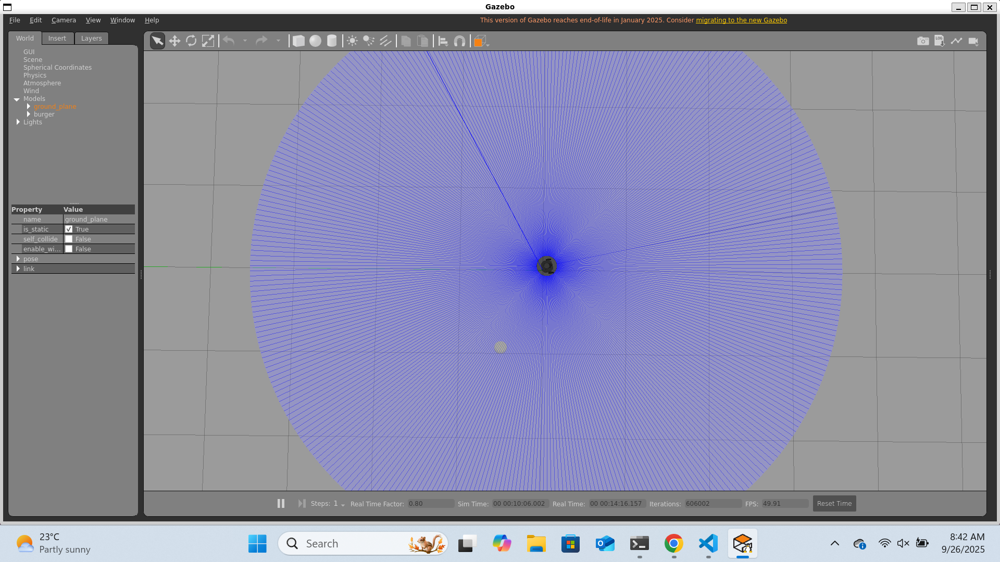
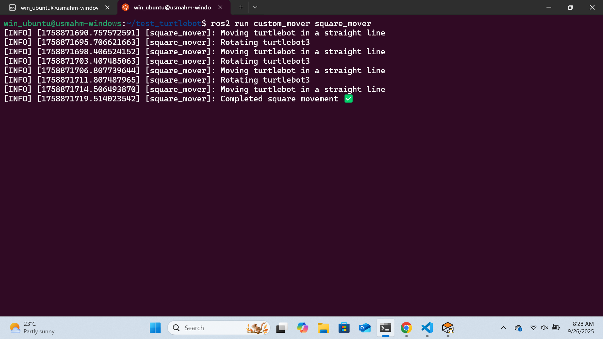

# 🟦 ROS 2 Workshop: Move TurtleBot3 in a Square Pattern

Welcome to the final day of our **ROS 2 Workshop Series** 🎉  
Today, we’ll bring everything we have been learning together by writing our own **control node** to make the TurtleBot3 move in a **square path** inside Gazebo 🚀.

---

## 📌 Prerequisites

- Ubuntu 22.04 with **ROS 2 Humble** installed
- Completed Day 1 to Day 4 of this workshop
- TurtleBot3 simulation running in Gazebo
- Basic understanding of ROS 2 nodes and topics

---

## 1. Create the Package

We create our custom package within the turtlebot3 workspace `~/turtlebot3_ws/src`:

```bash
cd ~/turtlebot3_ws/src
ros2 pkg create --build-type ament_python custom_mover
```

---

## 2. Write the Square Movement Node

Create the square_mover script and write the node:  
`custom_mover/custom_mover/square_mover.py`

```python
import rclpy
from rclpy.node import Node
from geometry_msgs.msg import Twist

class SquareMover(Node):
    def __init__(self):
        super().__init__('square_mover')
        self.publisher_ = self.create_publisher(Twist, 'cmd_vel', 10)

        # State initialization
        self.state = "forward"   # "forward" or "turn"
        self.step_count = 0      # counts ticks
        self.edge_count = 0      # counts edges of square

        # Parameters
        self.forward_steps = 50   # ~5s forward
        self.turn_steps = 27      # ~2.7s turn

        self.timer = self.create_timer(0.1, self.move_robot)

    def move_robot(self):
        msg = Twist()

        # Stop if max edges reached
        if self.edge_count >= 4:
            self.publisher_.publish(msg)
            self.get_logger().info("Completed square pattern movement ✅")
            rclpy.shutdown()
            return

        if self.state == "forward":
            if self.step_count == 0:
                self.get_logger().info("Moving turtlebot in a straight line")

            msg.linear.x = 0.2
            msg.angular.z = 0.0
            self.step_count += 1

            if self.step_count >= self.forward_steps:
                self.edge_count += 1
                self.state = "turn"
                self.step_count = 0

        elif self.state == "turn":
            if self.step_count == 0:
                self.get_logger().info("Rotating turtlebot3")

            msg.linear.x = 0.0
            msg.angular.z = 0.7
            self.step_count += 1

            if self.step_count >= self.turn_steps:
                self.state = "forward"
                self.step_count = 0

        self.publisher_.publish(msg)

def main(args=None):
    rclpy.init(args=args)
    node = SquareMover()

    try:
        rclpy.spin(node)
    except KeyboardInterrupt:
        pass
    finally:
        stop_msg = Twist()
        node.publisher_.publish(stop_msg)
        node.destroy_node()
        rclpy.shutdown()

if __name__ == '__main__':
    main()
```

---

## 3. Understanding the Message Type: `geometry_msgs/Twist`

Here’s the actual `.msg` definition of **Twist** we used:

```msg
# This expresses velocity in free space broken into its linear and angular parts.
Vector3 linear
Vector3 angular
```

And the `.msg` for **Vector3**:

```msg
# This represents a vector in free space.
float64 x
float64 y
float64 z
```

👉 For TurtleBot3:

- `linear.x` → forward/backward
- `angular.z` → rotate in place
- all others → unused in our case

---

## 4. Update `package.xml`

Now that we’ve written the node, we know it depends on:

- `rclpy` (the Python ROS 2 client library)
- `geometry_msgs` (for the `Twist` message type)

So open `custom_mover/package.xml` and add these:

```xml
<build_depend>rclpy</build_depend>
<build_depend>geometry_msgs</build_depend>
```

---

## 5. Update `setup.py`

Inside `custom_mover/setup.py`, add an entry point for our node script:

```python
entry_points={
    'console_scripts': [
        'square_mover = custom_mover.square_mover:main',
    ],
},
```

---

## 6. Build and Run

Rebuild the package:

```bash
cd ~/turtlebot3_ws
colcon build
source install/setup.bash
```

---

Launch TurtleBot3 in Gazebo from your terminal

```bash
export TURTLEBOT3_MODEL=waffle
ros2 launch turtlebot3_gazebo turtlebot3_world.launch.py
```



Run the node we just created in another terminal while Gazebo simulation is running (do not forget to run your workspace setup bash):

```bash
ros2 run custom_mover square_mover
```

📸 _Screenshot placeholder:_  


---

## 🎯 Wrap-Up

In this final workshop, you learned:

- What the **`geometry_msgs/Twist`** message looks like
- How to publish velocity commands to control a robot

✨ Congrats — you’ve now built a complete ROS 2 node that **controls a simulated robot**!

💡 _Try modifying it to make a rectangle, triangle, or infinite loop pattern!_
