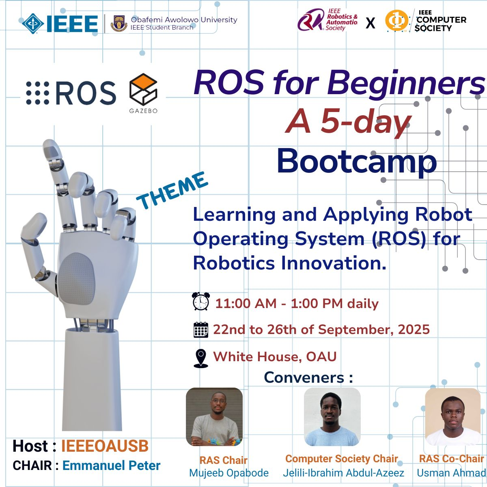

# 🤖 ROS for Beginners: A 5-Day Bootcamp

Welcome to the **ROS for Beginners Bootcamp**, organized by the **IEEE OAU Student Branch**.  
This 5-day program introduces participants to the **Robot Operating System (ROS 2)**, focusing on learning and applying it for robotics innovation.  
The sessions are designed to be practical, beginner-friendly, and engaging for students eager to explore robotics.

---

---

## 🗓 Details

- **Date:** 22nd – 26th September, 2025
- **Time:** 11:00 AM – 1:00 PM daily
- **Venue:** White House, Obafemi Awolowo University

---

## 🎯 Goal

By the end of the bootcamp, participants will:

- Understand ROS 2 basics (nodes, topics, services)
- Run simulations with **Gazebo** and **turtlesim**
- Gain hands-on experience building simple robotics projects

---
